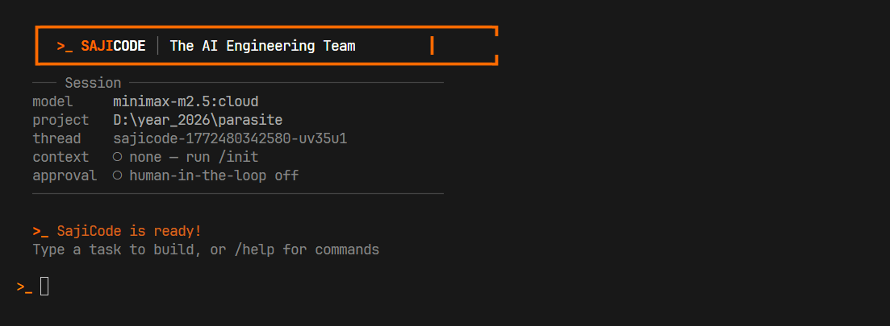

<p align="center">
  <picture>
    <source media="(prefers-color-scheme: dark)" srcset="./logo.svg">
    
  </picture>
</p>

<p align="center">
  <strong>The AI engineering team in your terminal.</strong><br/>
  <em>17 specialized agents × 21 expert skills — builds production software, not prototypes.</em>
</p>

<p align="center">
  <a href="https://github.com/raheesahmed/sajicode/stargazers"></a>
  <a href="https://github.com/raheesahmed/sajicode/blob/main/LICENSE"></a>
  <a href="https://www.npmjs.com/package/sajicode"></a>
  <a href="https://nodejs.org"></a>
</p>

<p align="center">
  <a href="#why-sajicode">Why</a> ·
  <a href="#quickstart">Quickstart</a> ·
  <a href="#whatsapp-integration">WhatsApp</a> ·
  <a href="#how-it-works">How It Works</a> ·
  <a href="#architecture">Architecture</a> ·
  <a href="#features">Features</a> ·
  <a href="#model-support">Models</a> ·
  <a href="#mcp-integration">MCP</a> ·
  <a href="#contributing">Contributing</a>
</p>

<br/>

<p align="center">
  
</p>

---

## Why SajiCode?

Current AI coding assistants use a **single agent** to handle everything. This breaks down fast:

- ❌ Context loss on large changes — the model forgets what it just built
- ❌ Placeholder code everywhere (`// TODO: implement later`)
- ❌ No quality checks — broken imports, missing files, untested code ships
- ❌ Constant babysitting — you become the project manager

**SajiCode** replaces the single agent with a **distributed team of 17 specialized agents** — exactly how real engineering teams work:

- ✅ **PM plans**, backend builds API, frontend builds UI — **in parallel**
- ✅ QA writes tests, security scans vulnerabilities — **after every build**
- ✅ Judgment middleware **blocks placeholder code** before it reaches disk
- ✅ Each agent has **territory** — backend can't touch frontend files and vice versa

---

## Quickstart

```bash
git clone https://github.com/raheesahmed/sajicode.git
cd sajicode
npm install
npm run build
```

### Run with your preferred model

```bash
# Local (no API key needed)
node dist/index.js -p ollama -m llama3.1:70b

# Cloud providers
node dist/index.js -p openai -m gpt-4.1
node dist/index.js -p google -m gemini-2.5-flash
node dist/index.js -p anthropic -m claude-sonnet-4-20250514
```

### Environment variables

```bash
# Set the API key for your chosen provider
export OPENAI_API_KEY="sk-..."
export GOOGLE_API_KEY="..."           # or GEMINI_API_KEY
export ANTHROPIC_API_KEY="sk-ant-..."
export TAVILY_API_KEY="tvly-..."      # optional — enables web search
```

---

## WhatsApp Integration

Send coding tasks from your phone. SajiCode connects directly to WhatsApp — no third-party service, no API key, just scan a QR code.

```bash
# Start SajiCode with WhatsApp channel
node dist/index.js --channels whatsapp
```

**First run:** A QR code appears in your terminal. Scan it with WhatsApp (Settings → Linked Devices → Link a Device). Auth is saved globally to `~/.sajicode/whatsapp-auth/` — you only scan once, works across all projects.

**After that:** Send any message from WhatsApp → SajiCode processes it → replies directly in the chat.

```
Phone (WhatsApp) → Baileys WebSocket → Channel Adapter
                                             ↓
                                       SajiCode Agent Core
                                             ↓
                                    WhatsApp Reply (auto-chunked)
```

**How it works:**
- Uses [`@whiskeysockets/baileys`](https://github.com/WhiskeySockets/Baileys) — the same library powering [OpenClaw](https://github.com/openclaw/openclaw)
- WebSocket protocol, no browser, no Selenium
- Auto-reconnects on disconnect
- Long responses are chunked to fit WhatsApp's 4096 char limit
- CLI still works normally alongside WhatsApp

**Two modes (configurable):**

| Mode | Who uses it | What it does |
|:---|:---|:---|
| **Admin Mode** (default) | You, the developer | Send coding tasks from your phone → SajiCode builds them |
| **Personal Bot Mode** | Your contacts | AI assistant that learns your chat style and replies on your behalf |

In Admin Mode, only your own messages are processed as commands. In Personal Bot Mode, incoming messages from contacts are handled by a personalized AI that adapts to your tone and conversation patterns.

**Configure in `.sajicode/config.json`:**

```json
// Admin Mode (default) — send coding tasks from your phone
{
  "whatsapp": {
    "enabled": true,
    "mode": "admin"
  }
}
```

```json
// Personal Bot Mode — AI replies to your contacts in your style
{
  "whatsapp": {
    "enabled": true,
    "mode": "personal",
    "personalBotPrompt": "Reply like Rahees — friendly, direct, use emojis sometimes."
  }
}
```

When `enabled` is `true` in config, WhatsApp starts automatically — no `--channels` flag needed.

> **Coming soon:** Discord and Telegram channels using the same adapter pattern.

## How It Works

**Step 1 — You describe what to build**

```
>_ build a fullstack task management app with Express API, SQLite, and React dashboard
```

**Step 2 — PM Agent architects the solution**

The PM scans your codebase with `collect_repo_map`, creates `architecture.md` with system diagrams, API tables, and file ownership map, then presents the plan.

**Step 3 — Parallel delegation to specialists**

```
PM Agent
  ├─▶ Backend Lead → "Build Express REST API in src/routes/, src/models/"
  ├─▶ Frontend Lead → "Build React dashboard in src/components/, src/pages/"
  │
  ├─▶ QA Lead → "Write tests for all endpoints and components"
  ├─▶ Security Lead → "Audit for XSS, injection, hardcoded secrets"
  └─▶ Review Agent → "Final quality gate — no TODOs, no broken imports"
```

**Step 4 — Each lead delegates further**

Backend Lead spawns `api-builder` and `db-designer` to work concurrently. Frontend Lead spawns `component-builder` and `style-designer`. The work is parallel at every level.

**Step 5 — Production-ready output**

Every file is validated by the judgment middleware (no placeholder code allowed), tested by QA, audited by security, and reviewed before the task completes.

---

## Architecture

```
                        ┌──────────────┐
                        │   PM Agent   │
                        └──────┬───────┘
                               │
            ┌────────┬─────────┼─────────┬────────┐
            │        │         │         │        │
       ┌────▼────┐┌──▼────┐┌───▼────┐┌───▼────┐┌──▼────┐
       │ Backend ││ Front ││   QA   ││ Secur. ││ Deploy│
       │  Lead   ││  Lead ││  Lead  ││  Lead  ││  Lead │
       └────┬────┘└───┬───┘└───┬────┘└───┬────┘└───┬───┘
            │         │        │         │         │
          api db   comp style unit integ vuln dep docker ci
         bldr dsgn bldr dsgn  tstr tstr  scan aud  spec spec
```

**1 PM + 6 Leads + 10 Sub-agents = 17 agents total**

Each agent has:
- **Owned directories** — files it can create/modify
- **Forbidden paths** — files it must never touch
- **Persistent memory** — remembers what it built across sessions
- **Skills** — 21 expert skill files covering full-stack development, AI engineering, system architecture, debugging, and more

### The Team

| Agent | Sub-Agents | Territory | Role |
|:---|:---|:---|:---|
| **PM Agent** | *All Leads* | Orchestration | Plans architecture, delegates tasks, validates output |
| **Backend Lead** | `api-builder`, `db-designer` | `src/routes/`, `src/models/`, `src/services/` | APIs, database, auth, server logic |
| **Frontend Lead** | `component-builder`, `style-designer` | `src/components/`, `src/pages/`, `public/` | Premium UI, responsive design, animations |
| **QA Lead** | `unit-tester`, `integration-tester` | `tests/`, `__tests__/` | Test coverage, TDD, edge cases |
| **Security Lead** | `vuln-scanner`, `dep-auditor` | Security policies | OWASP scanning, dependency audit |
| **Deploy Lead** | `docker-specialist`, `ci-specialist` | `Dockerfile`, `.github/` | Docker, CI/CD, hosting |
| **Review Agent** | — | Read-only | Final quality gate, no TODOs/stubs allowed |

---

## Features

### Multi-Agent Orchestration

The PM delegates to multiple leads simultaneously, and each lead further delegates to sub-agents. No waterfall — everything that can run in parallel does.

### Judgment Middleware — Zero Placeholder Code

A 3-layer protection system that wraps every tool call:

1. **Risk assessment** — warns on destructive operations (`rm -rf`, `drop table`) and sensitive paths (`.env`, `credentials`)
2. **Placeholder blocking** — **blocks** `write_file` if content contains `TODO`, `FIXME`, placeholder stubs, or empty function bodies. The agent is forced to write real code
3. **Loop detection** — detects when an agent calls the same tool 3+ times identically and breaks the loop

### Human-in-the-Loop (HITL)

Optional approval system for shell commands and file deletions:

```json
// .sajicode/config.json
{
  "humanInTheLoop": {
    "enabled": true,
    "tools": {
      "execute": { "allowedDecisions": ["approve", "edit", "reject"] },
      "delete_file": { "allowedDecisions": ["approve", "reject"] }
    },
    "allowedCommands": ["npm install", "npm run", "mkdir", "node "]
  }
}
```

Safe commands (like `npm install`) are auto-approved. Dangerous ones require your explicit approval.

### Multi-Provider LLM Support

| Provider | Flag | Example |
|:---|:---|:---|
| Ollama (local) | `-p ollama` | `deepseek-v3.1:671b-cloud`, `llama3.1:70b` |
| OpenAI | `-p openai` | `gpt-4.1`, `gpt-4o` |
| Google | `-p google` | `gemini-2.5-flash`, `gemini-2.5-pro` |
| Anthropic | `-p anthropic` | `claude-sonnet-4-20250514` |

### Codebase Intelligence

The `collect_repo_map` tool scans your entire project and extracts function/class/interface signatures across **7 languages** (TypeScript, JavaScript, Python, Go, Java, Rust, Ruby). Agents get a ~50 token/file condensed map instead of reading 500+ tokens per file.

### Persistent Memory System

```
.sajicode/
├── config.json          # Model, HITL, and risk settings
├── architecture.md      # Current project architecture plan
├── whats_done.md        # Shared team log — append-only
├── memories/            # Long-term user preferences
│   └── preferences.md
├── agents/              # Per-agent structured JSON memory
│   ├── backend-lead.json
│   ├── frontend-lead.json
│   └── ...
└── mcp-servers.json     # MCP server configurations
```

Every agent's memory persists across sessions. When you start a new thread, agents remember what they built before, what contracts they established with other agents, and your preferences.

### 21 Expert Skills

Skills are modular knowledge files following the [Agent Skills specification](https://agentskills.io). Agents read them on-demand via progressive disclosure — loading only what's needed for the current task.

| Skill | Capability |
|:---|:---|
| **Core** | |
| `superpowers` | Systematic engineering workflow, multi-file refactoring safety, code quality standards |
| `debugger` | Error analysis, git bisect, memory profiling, systematic debugging methodology |
| `web-research` | Multi-source research, package evaluation, technology comparison matrices |
| **Full-Stack** | |
| `fullstack-app-generator` | End-to-end app scaffolding — framework selection, auth, schema, deployment |
| `api-architect` | REST/GraphQL design, OAuth/JWT auth, webhooks, API clients, rate limiting |
| `nodejs` | Express/Fastify/Hono, Redis caching, WebSockets, BullMQ, graceful shutdown |
| `nextjs` | Next.js 15 App Router, server actions, middleware auth, ISR/SSG/SSR |
| `python-engineer` | FastAPI, pytest, Typer CLI, pandas data processing |
| **Frontend** | |
| `frontend-design` | Design systems, animation patterns, anti-slop rules, accessibility |
| `shadcn-ui` | Forms + Zod, sortable data tables, theming, component composition |
| `styling` | CSS architecture, design tokens, container queries, animation system |
| `3d-web-experience` | Three.js, React Three Fiber, Spline, scroll-driven 3D, model pipeline |
| **Infrastructure** | |
| `database` | Prisma, Drizzle, query optimization, index strategies, N+1 prevention |
| `devops` | Docker, GitHub Actions CI/CD, Vercel/AWS deployment, monitoring |
| `security` | OWASP Top 10 fixes, auth implementation, CSP headers, secrets management |
| `testing` | Unit/integration/E2E (Playwright), test factories, mocking, CI config |
| `performance-optimizer` | Core Web Vitals, bundle analysis, caching, memory leak detection |
| **Specialized** | |
| `ai-engineer` | LangGraph agents, RAG pipelines, prompt engineering, cost optimization |
| `architect` | System design, event-driven architecture, CQRS, ADR templates, scaling |
| `mcp-server` | MCP tool/resource/prompt patterns, transports, deployment |
| `mobile-app` | React Native, Expo Router, offline-first, push notifications |

---

## MCP Integration

SajiCode connects to [Model Context Protocol](https://modelcontextprotocol.io) servers, giving your agents access to external tools.

### Configuration

Create `.sajicode/mcp-servers.json`:

```json
{
  "mcpServers": {
    "code-context": {
      "command": "npx",
      "args": ["-y", "@anthropic/code-context-server", "{{projectPath}}"],
      "transport": "stdio"
    },
    "database": {
      "command": "npx",
      "args": ["-y", "@modelcontextprotocol/server-sqlite", "./data/app.db"],
      "transport": "stdio"
    }
  }
}
```

`{{projectPath}}` is automatically replaced with your project's absolute path. MCP tools are injected into the PM agent and available immediately.

---

## CLI Reference

| Command | Action |
|:---|:---|
| `/init` | Scans project and generates `SAJICODE.md` context file |
| `/status` | Shows session info — thread, model, context, HITL status |
| `/help` | Lists all available commands |
| `/clear` | Clears the terminal |
| `/exit` | Gracefully shuts down all agents and MCP connections |

### CLI Flags

```bash
node dist/index.js [options]

  -p, --provider <name>    LLM provider (ollama, openai, google, anthropic)
  -m, --model <name>       Model name
  -c, --channels <list>    Comma-separated channels to start (whatsapp)
```

**Examples:**
```bash
# Terminal only (default)
node dist/index.js -p ollama -m llama3.1:70b

# Terminal + WhatsApp
node dist/index.js -p openai -m gpt-4.1 --channels whatsapp
```

---

## Project Structure

```
src/
├── index.ts              # REPL entrypoint, HITL handling, stream processing
├── agents/
│   ├── index.ts          # createSajiCode() — main agent factory
│   ├── agent-factory.ts  # Dynamic agent creation from AgentSpec presets
│   ├── domain-heads.ts   # Thin wrapper → agent factory
│   ├── context.ts        # Project context and memory loading
│   ├── judgment.ts       # 3-layer protection middleware
│   └── onboarding.ts     # Interactive project setup
├── channels/
│   ├── channel.ts        # Unified ChannelAdapter interface
│   ├── whatsapp.ts       # WhatsApp adapter (Baileys)
│   └── router.ts         # Routes channel messages → agent core
├── cli/
│   ├── renderer.ts       # StreamRenderer — terminal UI with markdown streaming
│   ├── index.ts          # Commander-based CLI (build, init, audit)
│   └── progress.ts       # Progress bar tracking
├── prompts/
│   ├── pm.ts             # PM system prompt — architecture-first workflow
│   └── specialists.ts    # Expert prompts for all 6 domain leads
├── llms/
│   └── provider.ts       # Multi-provider LLM factory
├── mcp/
│   └── MCPClient.ts      # MCP server connection manager
├── memory/
│   └── agent-memory.ts   # Structured JSON agent memory system
├── tools/
│   ├── context-tools.ts  # 5 LangChain tools (context, memory, log)
│   ├── repo-map.ts       # Codebase symbol scanner (7 languages)
│   └── web-search.ts     # Tavily web search
├── types/
│   └── config.ts         # TypeScript types, AgentRole, icons, labels
└── utils/
    ├── platform.ts       # OS detection, platform-specific prompts
    └── skills.ts         # Auto-discovery of skill directories
```

---

## Contributing

```bash
git clone https://github.com/raheesahmed/sajicode.git
cd sajicode
npm install
npm run build
```

**Development workflow:**
1. Edit TypeScript in `src/`
2. `npm run build` to compile
3. `node dist/index.js` to test
4. Skills go in `skills/<name>/SKILL.md`

We welcome PRs for new skills, LLM provider support, and agent improvements.

---

## License

MIT — see [LICENSE](./LICENSE)

<p align="center">
  Built by <a href="https://github.com/raheesahmed">Rahees Ahmed</a>
</p>